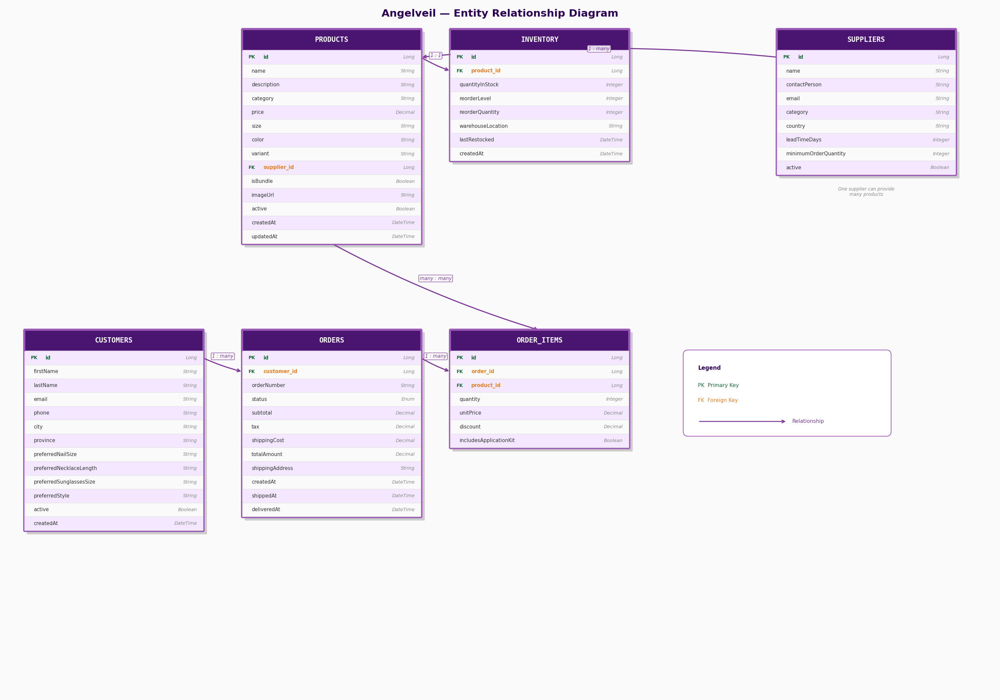

# Data Structure

## Entity Relationship Diagram



---

## How the tables relate

```
SUPPLIERS ──< PRODUCTS ──── INVENTORY
                   |
              ORDER_ITEMS
                   |
CUSTOMERS ──< ORDERS
```

- One **Supplier** can supply many **Products**
- One **Product** has exactly one **Inventory** record
- One **Customer** can place many **Orders**
- One **Order** contains many **Order Items**
- One **Product** can appear in many **Order Items**

---

## Tables

### PRODUCTS
The core catalogue. Every item the company sells is a product.

| Field | Type | Notes                                                                     |
|---|---|---------------------------------------------------------------------------|
| id | Long | Primary key, auto-generated                                               |
| name | String | e.g. "Rose Garden"                                                        |
| description | String | Up to 500 characters                                                      |
| category | String | `press-on nails` / `necklaces` / `rings`                                  |
| price | Decimal | Retail price in CAD                                                       |
| size | String | `Small` / `Medium` / `Large` / `16in` / `18in` / `20in`  more to be added |
| color | String | e.g. "Rose Gold", "Black"                                                 |
| variant | String | e.g. "Matte", "Glitter", "Gold Plated"                                    |
| supplier_id | Long | FK → SUPPLIERS — which supplier provides this product                     |
| isBundle | Boolean | `true` = this product is a kit with sub-components                        |
| imageUrl | String | Path to product image e.g. `/images/abc123.jpg`                           |
| active | Boolean | `false` = soft-deleted, hidden from storefront                            |
| createdAt | DateTime | Set automatically on creation                                             |
| updatedAt | DateTime | Set automatically on every update                                         |

---

### INVENTORY
Tracks stock levels. There is exactly **one inventory record per product**.

| Field | Type | Notes |
|---|---|---|
| id | Long | Primary key |
| product_id | Long | FK → PRODUCTS |
| quantityInStock | Integer | Current units available |
| reorderLevel | Integer | Show a low-stock alert when stock hits this number |
| reorderQuantity | Integer | How many units to order when restocking |
| warehouseLocation | String | Shelf location e.g. "Zone-B-7" |
| lastRestocked | DateTime | When stock was last topped up |
| createdAt | DateTime | Auto |
| updatedAt | DateTime | Auto |

> **Computed field:** `needsReorder` — not stored in the DB, calculated on the fly. Returns `true` when `quantityInStock ≤ reorderLevel`. Use this to drive alert badges in the UI.

---

### CUSTOMERS
Stores both contact info and **size profile** data which powers the size matching feature.

| Field                   | Type | Notes                                         |
|-------------------------|---|-----------------------------------------------|
| id                      | Long | Primary key                                   |
| firstName               | String |                                               |
| lastName                | String |                                               |
| email                   | String | Unique — used to identify customers           |
| phone                   | String |                                               |
| address                 | String | Street address                                |
| city                    | String | e.g. "Toronto"                                |
| province                | String | e.g. "ON"                                     |
| postalCode              | String | e.g. "M5V 3A8"                                |
| preferredNailSize       | String | `Small` / `Medium` / `Large`                  |
| preferredNecklaceLength | String | `14in` / `16in` / `18in` / `20in`             |
| preferredRingSize       | String | TBD                                           |
| preferredStyle          | String | `Modern` / `Classic` / `Bohemian` / `Vintage` |
| active                  | Boolean | `false` = soft-deleted                        |
| createdAt               | DateTime | Auto                                          |

> The four `preferred*` fields are what the **Size Profile Matching** feature reads to filter products.

---

### ORDERS
A purchase placed by a customer. All money totals are **calculated by the server** — the frontend only sends `shippingCost`.

| Field | Type | Notes |
|---|---|---|
| id | Long | Primary key |
| customer_id | Long | FK → CUSTOMERS |
| orderNumber | String | Human-readable ID auto-generated by server e.g. `ORD-20260211143022` |
| status | Enum | `PENDING` → `CONFIRMED` → `PROCESSING` → `SHIPPED` → `DELIVERED` / `CANCELLED` |
| subtotal | Decimal | Sum of all items — server calculates |
| tax | Decimal | 13% HST — server calculates |
| shippingCost | Decimal | Sent by frontend |
| totalAmount | Decimal | subtotal + tax + shippingCost — server calculates |
| shippingAddress | String | Full address string |
| notes | String | Order notes |
| createdAt | DateTime | When order was placed |
| shippedAt | DateTime | Auto-set when status changes to `SHIPPED` |
| deliveredAt | DateTime | Auto-set when status changes to `DELIVERED` |

---

### ORDER_ITEMS
Individual line items within an order. Price is **snapshotted at the time of purchase** — so changing a product's price later doesn't affect old orders.

| Field | Type | Notes |
|---|---|---|
| id | Long | Primary key |
| order_id | Long | FK → ORDERS |
| product_id | Long | FK → PRODUCTS |
| quantity | Integer | Number of units ordered |
| unitPrice | Decimal | Product price at time of order (snapshot) |
| discount | Decimal | Discount amount, defaults to 0.00 |
| includesApplicationKit | Boolean | If `true` and product is a bundle — triggers sub-inventory decrement |

---

### SUPPLIERS
Contact information for the companies that supply the products. Currently standalone — a future version will link them to products.

| Field | Type | Notes |
|---|---|---|
| id | Long | Primary key |
| name | String | Company name — one supplier can have many products |
| contactPerson | String | Name of primary contact |
| email | String | |
| category | String | `Nails Manufacturer` / `Jewelry Wholesaler` / `Sunglasses Supplier` |
| country | String | e.g. "Canada", "China", "Italy" |
| leadTimeDays | Integer | Average days from order to delivery |
| minimumOrderQuantity | Integer | Minimum units per purchase order |
| active | Boolean | |

---

## Allowed Values (Enums & Fixed Strings)

| Field              | Options                                                                        |
|--------------------|--------------------------------------------------------------------------------|
| Order `status`     | `PENDING` / `CONFIRMED` / `PROCESSING` / `SHIPPED` / `DELIVERED` / `CANCELLED` |
| `category`         | `press-on nails` / `necklaces` / `sunglasses`                                  |
| `size` (rings)     | TBD                                                                            |
| `size` (necklaces) | `14in` / `16in` / `18in` / `20in`                                              |
| `preferredStyle`   | TBD                                                                            |
